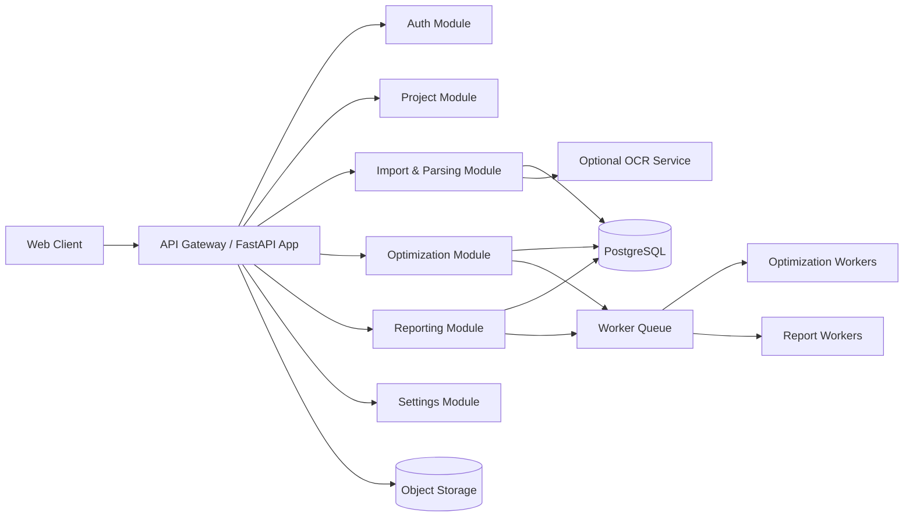
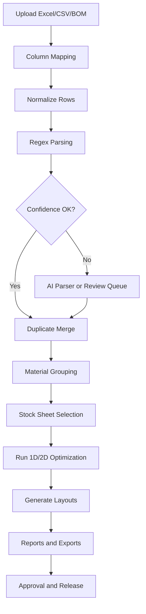
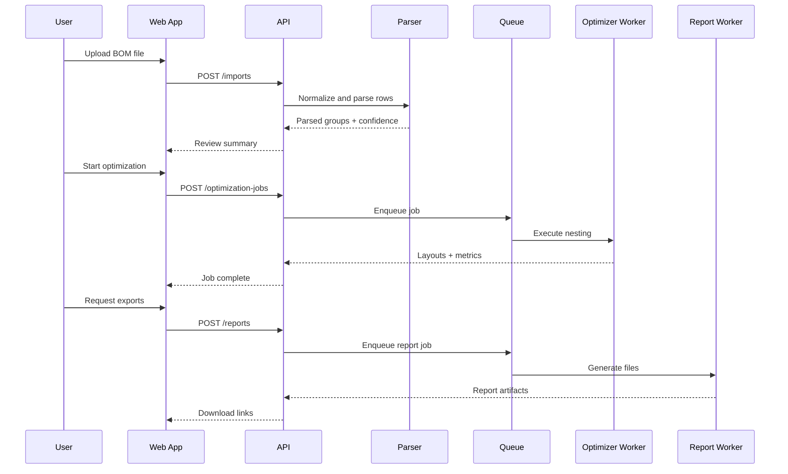
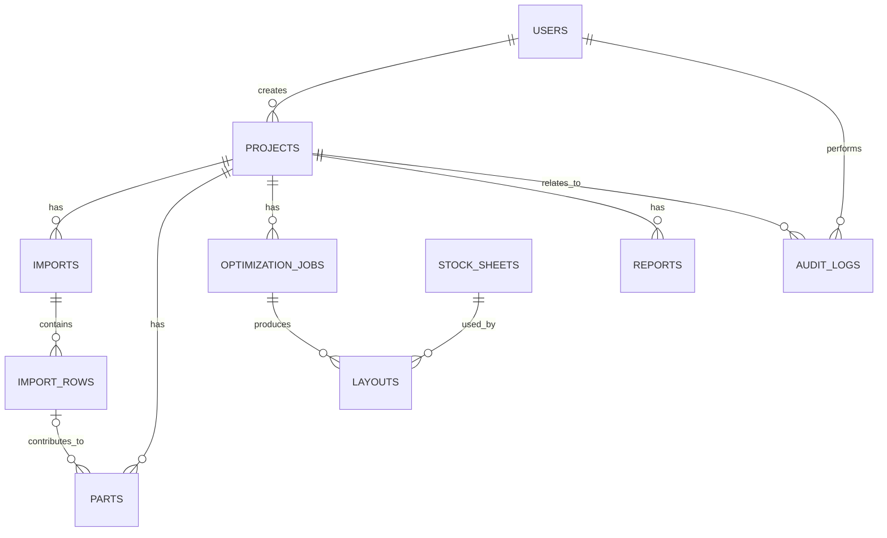

# SteelNest AI Platform Blueprint

**Proposed enterprise product name:** **SteelNest AI** — AI-Powered Plate, Profile, and Fabrication Optimization Platform.

This document is a combined Software Requirements Specification, Technical Design Document, Product Blueprint, Solution Architecture Guide, and AI-assisted implementation plan for an industrial fabrication planning platform focused on steel plate and profile optimization. It is written to align product strategy, engineering design, system architecture, and phased implementation so that investors, architects, developers, and future AI coding agents can build from a single source of truth.

## Document purpose

Steel fabrication shops still rely on fragmented workflows where engineering drawings, bill-of-material exports, spreadsheet preparation, thickness grouping, cut-list generation, nesting software import, procurement planning, and production release are handled across multiple disconnected tools and manual steps. Commercial nesting platforms position themselves around material savings, integration with CAD/CAM workflows, inventory, quoting, remnant handling, and automated planning, which confirms that the industry values workflow compression as much as pure nesting quality.[web:4][web:6][web:7] This blueprint defines a product that initially focuses on digital BOM-driven plate optimization and later expands toward profiles, CNC outputs, ERP integration, and AI-assisted fabrication planning.[web:4][web:6][web:7]

## Executive overview

The proposed platform ingests structured fabrication inputs such as Excel, CSV, ERP exports, CAD-generated BOMs, and manual entries; normalizes parts and materials; classifies parts into manufacturable groups; optimizes sheet usage using 1D and 2D packing algorithms; and generates actionable purchase, production, and reporting outputs. Nesting software is widely used to maximize material utilization, reduce manual placement effort, improve production efficiency, and support interactive review of layouts before release, making this product direction commercially sound.[web:7] Modern fabrication platforms also differentiate through integration with business systems, remnant management, quoting, and shop-floor traceability, which supports building this product as more than a narrow optimization engine.[web:4][web:6]

The MVP should deliberately avoid OCR dependency. OCR on poor-quality fabrication drawings often introduces ambiguity in dimensions, material codes, and symbols, while modern fabrication workflows already produce structured exports from spreadsheets, BIM/CAD tools, and ERP systems; software vendors in this space emphasize import pipelines and workflow integration rather than OCR as the core data source.[web:4][web:6][web:7] OCR should therefore be implemented as an optional helper that assists when no structured input exists, but the primary architecture must assume digital tabular data as the source of truth.[web:4][web:6]

## Industry context

### Current fabrication workflow

A common workflow in steel fabrication begins when a design engineer creates a CAD or BIM model and exports a drawing package or bill of materials. Fabrication or planning engineers then open these drawings, read tables manually, retype line items into Excel, separate items by material family and thickness, prepare manual cut lists, import them into a nesting tool, inspect waste, decide sheet purchases, and only then release work to procurement and production. Commercial systems explicitly market import from design/BIM tools, list management, automatic nesting, summary sheets, quotations, inventory linkage, and production coordination, which indicates that the manual multi-step workflow remains a pain point in the market.[web:4][web:6]

This workflow is slow because information is repeatedly re-entered across tools. It is repetitive because the same fields—material, thickness, quantity, dimensions, lengths, and mark numbers—are classified multiple times in Excel, nesting, and purchasing stages. It is error-prone because each manual transcription step can corrupt dimensions or quantities; Autodesk’s customer example specifically highlights that one incorrect manual value can propagate into a large batch of incorrectly sized sheets.[web:7] It is expensive because poor grouping, suboptimal nesting, and disconnected procurement decisions increase scrap, labor cost, and schedule uncertainty, while large fabrication suites market profitability gains through better nesting, quoting, scheduling, and purchasing coordination.[web:4][web:6][web:7]

### Why large projects suffer more

The manual approach scales badly with project size because line item counts, material variants, revision churn, and remnant tracking all increase together. Once hundreds or thousands of parts exist across multiple thicknesses and materials, spreadsheet-based filtering, duplicate merging, and purchase planning become operational bottlenecks. Vendors such as SigmaNEST and STRUMIS emphasize business integration, scheduling, inventory, remnant workflow, and automated import precisely because large shops cannot afford to manage those variables manually at scale.[web:4][web:6]

### Core business pain points

| Pain point | Operational impact | Why the platform matters |
|---|---|---|
| Manual data re-entry | Time loss, clerical errors, version mismatch | Structured ingestion eliminates repetitive transcription.[web:4][web:7] |
| Manual grouping by thickness/material | Planning delay, inconsistent rules | Rule-driven normalization standardizes grouping.[web:4][web:6] |
| Separate nesting and purchase decisions | High scrap or poor buying choices | Optimization plus purchase comparison improves yield and cost planning.[web:6][web:7] |
| Weak remnant visibility | Usable stock is ignored | Future remnant inventory workflows mirror market-leading suites.[web:4][web:6] |
| Poor traceability | Difficult audit and revisions | Project, job, and report lineage supports enterprise readiness.[web:6] |

## Product vision

SteelNest AI is intended to evolve from a plate-focused optimizer into a fabrication planning operating layer. In the near term, it should automate structured input ingestion, parsing, grouping, nesting, and reporting. In the medium term, it should manage remnants, purchasing decisions, profile cutting, cost estimation, and ERP synchronization. In the long term, it should act as an AI planning assistant that understands engineering data, compares stock strategies, predicts scrap, and drives CNC/CAM or ERP workflows through APIs.

### Primary objectives

- Reduce material wastage through algorithmic nesting and purchase comparison.[web:7][web:12]
- Reduce human planning effort by automating extraction, parsing, grouping, and duplication merge logic.[web:4][web:7]
- Reduce lead time from BOM receipt to production-ready optimization output.[web:4][web:6]
- Improve accuracy by replacing manual spreadsheet interpretation with validated structured workflows.[web:7]
- Create a digital foundation for AI assistance, ERP exchange, inventory tracking, and future CAD/CAM integration.[web:4][web:6]

## Scope

### Current scope

The initial release should support plate and simple profile planning using structured data inputs such as Excel, CSV, and ERP exports. It should normalize line items, parse descriptions, classify parts, detect duplicates, optimize plate cutting, compare stock sheet purchase options, and generate reports in Excel, PDF, CSV, and JSON. This aligns with the most immediate value users expect from nesting software: improved material use, faster nesting, and better planning outputs.[web:7]

### Future scope

Future releases should add DXF generation, CNC file preparation, remnant reuse, costing, stock inventory, profile optimization, quotation support, shop-floor feedback, and AI copilots. Established platforms differentiate themselves through quoting, scheduling, inventory, remnant management, and machine integration, making these logical expansion paths.[web:4][web:6]

### Enterprise scope

Enterprise deployment should include role-based access, organization-level settings, audit logs, multi-project handling, approval workflows, API integrations, SSO, background optimization queues, high-volume imports, traceability, and observability. SigmaNEST and STRUMIS both market integration with broader business systems and production control, which supports designing the architecture for enterprise-grade extension rather than a single-user tool.[web:4][web:6]

### SaaS scope

A SaaS deployment should support multi-tenant organizations, cloud storage, browser-based optimization review, usage-based limits, subscription plans, and API-based integration with ERP/CAD exporters.

### Desktop scope

A desktop-first or hybrid deployment can be valuable for factories with poor internet connectivity, strict data residency requirements, or local machine connectivity needs. The preferred strategy is web-first architecture with optional desktop packaging via Tauri later.

### Cloud scope

The cloud architecture should prioritize managed storage, async workers, containerized APIs, and a PostgreSQL-backed data layer, while preserving a local SQLite mode for pilot deployments.

## Target users

### Fabrication engineer

The fabrication engineer is the primary operator. This user uploads BOM data, reviews parsed parts, resolves ambiguous descriptions, configures sheet options, runs optimization, validates layouts, and exports cut plans.

### Production engineer

The production engineer consumes approved layouts, shop packets, cut sheets, and summary reports. This role also provides feedback about machine constraints, kerf, preferred sheet sizes, and manufacturability restrictions.

### Purchase department

The purchase department uses material summaries, stock-size comparisons, procurement recommendations, and weight/cost reports to choose the best buying option. Integration with inventory and supplier catalogs becomes more important as the product matures.[web:4][web:6]

### Planning department

Planning users coordinate sequencing, work-package release, revision tracking, and due-date alignment. They benefit from optimization summaries, grouped part views, and remnant usage recommendations.

### Project manager

Project managers need project-level dashboards, waste metrics, cost insight, progress snapshots, and decision visibility across engineering, purchasing, and production.

### Workshop supervisor

The workshop supervisor consumes printable layouts, cut packets, and part-tracking references. Later versions should provide QR or barcode links between digital plans and physical production.

### Management

Management uses high-level yield, cost, turnaround, and utilization reporting to measure performance and compare planning decisions across projects.[web:6]

## End-to-end workflow

### Stage 1: project creation

A user creates a project, selects business unit, customer, project code, drawing package revision, measurement units, and default optimization preferences.

### Stage 2: data ingestion

The user imports structured files such as Excel, CSV, ERP export, AutoCAD BOM, Tekla BOM, SolidWorks BOM, or enters data manually. The ingestion pipeline should preserve the raw file, parse sheets/tables, map columns, and create an import session with traceability metadata.

### Stage 3: table extraction and mapping

For Excel/CSV, the system reads headers and suggests mappings such as part mark, description, quantity, material, thickness, length, width, weight, drawing number, and remarks. For PDF or images, OCR and table extraction exist only as helper flows, never as the main route.

### Stage 4: normalization

The system standardizes units, trims whitespace, removes illegal characters, converts dimensions to canonical numeric fields, normalizes material names, and stores both raw and normalized representations for auditability.

### Stage 5: description parsing

The parser inspects fields like description, material code, remarks, and section strings to derive type, thickness, width, length, profile size, grade, and orientation hints. Regex rules should run first because they are deterministic and auditable; an AI parser should only handle unmatched or low-confidence rows.

### Stage 6: duplicate and quantity merge

Items sharing the same manufacturable identity—material family, thickness, dimensions, profile size, grade, edge condition, and machine-relevant attributes—are merged into aggregate quantities while keeping source lineage.

### Stage 7: material grouping

Parts are grouped into optimization buckets such as plate thickness groups, chequered plate groups, stainless groups, ISMC groups, ISMB groups, pipe groups, flats, angles, and round bars. This step determines which optimization engine and constraints apply.

### Stage 8: stock definition

The user provides available stock sizes, either from settings, supplier catalog, inventory import, or manual entry. The system attaches cost, weight, preferred suppliers, transport assumptions, and remnant policies.

### Stage 9: optimization

The optimization engine runs 2D nesting for plates and 1D cutting for bars/profiles, respecting rotation permissions, edge margins, kerf, trim loss, grain or pattern constraints, forbidden orientations, common-line options, and max runtime.

### Stage 10: visualization and review

Users inspect interactive layouts, zoom into sheets, rotate views, highlight part labels, inspect waste zones, and review utilization metrics. Interactive preview is a core expectation of nesting software because it lets users validate machine-feasible layouts and business trade-offs before release.[web:7]

### Stage 11: reporting and export

The platform generates cut layouts, purchase summaries, scrap reports, thickness summaries, material summaries, production packets, and structured exports in Excel, CSV, JSON, and PDF. Future DXF/CNC outputs should use this stage as the release boundary.

### Stage 12: approval and handoff

Approved jobs move into a released state, locking reports and publishing outputs to downstream systems such as ERP, inventory, or shop-floor execution.

## Why OCR must be optional

OCR should not be the architectural backbone because fabrication drawings often have noisy scans, mixed fonts, skewed tables, dimension symbols, and handwritten annotations that reduce extraction accuracy. Nesting software value comes from reliable structured geometry and metadata, not from best-effort recovery of low-quality drawings. The strongest commercial positioning in this category centers on import from design systems, CAD/BIM, material lists, business systems, and digital workflows rather than OCR-first data capture.[web:4][web:6][web:7]

A digital-first ingestion model has several advantages:

- It produces higher precision for dimensions and quantities than scan-based inference.
- It is easier to validate and audit because source rows can be traced back to exact digital fields.
- It supports repeatable automation across ERP exports and CAD-generated BOM formats.[web:4][web:6]
- It keeps the optimization engine independent from document-quality variance.
- It allows OCR to be added as a bounded helper module for exception cases rather than contaminating the core data pipeline.

Recommended architecture: treat OCR as a sidecar service that converts PDF or image tables into a provisional dataset, assigns low default confidence, and routes everything through the same normalization and validation pipeline used by Excel or CSV inputs.

## Data inputs

### Supported input types

| Input type | MVP support | Notes |
|---|---|---|
| Excel (.xlsx, .xls) | Yes | Primary input for planners and BOM exports. |
| CSV | Yes | Lightweight and ERP-friendly. |
| Manual entry | Yes | Useful for pilots and small jobs. |
| JSON/API | Yes | Supports integrations and automation. |
| ERP export | Yes | SAP/Tally/custom ERP adapters should map to canonical import schema. |
| AutoCAD BOM | Yes | Via exported table formats, not direct DWG parsing in MVP. |
| SolidWorks BOM | Yes | Via Excel/CSV export in MVP. |
| Tekla BOM | Yes | Via report export in MVP. |
| PDF | Partial | Table extraction/OCR helper only. |
| Image | Partial | OCR helper only. |

### Canonical import model

Every ingestion source should be mapped into a canonical row structure:

```json
{
  "source_row_id": "raw-00123",
  "part_mark": "P-101",
  "description": "PL 6 THK 200 x 300",
  "quantity": 4,
  "material_grade": "MS",
  "unit": "mm",
  "drawing_no": "A-102",
  "remarks": "",
  "raw_fields": {"...": "..."}
}
```

This canonical model makes downstream parsing source-agnostic.

## Data extraction and parsing

### Parsing strategy

Description parsing should use a layered approach:

1. Deterministic regex parser.
2. Rule engine with token dictionaries and unit normalization.
3. AI parser for unresolved or low-confidence patterns.
4. Human review queue for ambiguous rows.

### Example parse rules

| Raw description | Parsed type | Key extracted fields |
|---|---|---|
| PL 6 THK 200 x 300 | Plate | thickness=6, width=200, length=300 |
| CHQ.PL 6 THK 560 x 3200 | Chequered Plate | thickness=6, width=560, length=3200 |
| ISMC 150x75 1290 LG | ISMC | size=150x75, length=1290 |
| ISMB 200x100 180 LG | ISMB | size=200x100, length=180 |

### Regex philosophy

Regex should not aim to “understand fabrication” globally. It should extract constrained patterns from known families and hand off when confidence drops. Each material family gets its own pattern module.

Example patterns:

```python
PLATE_RE = r"\b(?P<type>PL|PLATE|CHQ\.?PL)\b\s*(?P<thk>\d+(?:\.\d+)?)\s*(?:THK|T|MM)?\s*(?P<w>\d+(?:\.\d+)?)\s*[xX*]\s*(?P<l>\d+(?:\.\d+)?)"
CHANNEL_RE = r"\b(?P<type>ISMC)\b\s*(?P<size>\d+\s*[xX]\s*\d+)\s*(?P<length>\d+(?:\.\d+)?)\s*(?:LG|L|LONG)?\b"
BEAM_RE = r"\b(?P<type>ISMB)\b\s*(?P<size>\d+\s*[xX]\s*\d+)\s*(?P<length>\d+(?:\.\d+)?)\s*(?:LG|L|LONG)?\b"
```

### Parser output contract

```json
{
  "material_family": "PLATE",
  "material_subtype": "CHEQUERED_PLATE",
  "thickness_mm": 6.0,
  "width_mm": 560.0,
  "length_mm": 3200.0,
  "profile_size": null,
  "rotation_allowed": true,
  "confidence": 0.96,
  "parse_method": "regex_plate_v2"
}
```

### Fallback AI parser

The AI parser should be used when deterministic parsing fails or confidence is below a configurable threshold, such as 0.80. It should receive raw text plus context such as known units, project defaults, and allowed material families. Its job is structured extraction, not free-form explanation.

Example prompt contract:

```json
{
  "description": "PLT 8MM 1500X3000 MS",
  "known_materials": ["MS", "SS", "CHQ.PL", "ISMC", "ISMB"],
  "units": "mm",
  "output_schema": {
    "material_family": "string",
    "thickness_mm": "number|null",
    "width_mm": "number|null",
    "length_mm": "number|null",
    "profile_size": "string|null"
  }
}
```

### Confidence scoring

Confidence should combine parser certainty with validation signals:

- Regex match completeness.
- Numeric plausibility.
- Allowed material family match.
- Unit consistency.
- Historical pattern frequency.
- Cross-column corroboration, such as thickness column matching description thickness.

Suggested score bands:

| Score | Meaning | System action |
|---|---|---|
| 0.95-1.00 | Highly reliable | Auto-accept |
| 0.80-0.94 | Good | Accept, highlight for optional review |
| 0.60-0.79 | Weak | Send to review queue |
| <0.60 | Unreliable | Block optimization until corrected |

## Data cleaning and validation

### Duplicate detection

Duplicates should be evaluated in two forms: exact duplicates and semantic duplicates. Exact duplicates share identical normalized material, thickness, dimensions, grade, and part mark. Semantic duplicates may have different source descriptions but result in the same manufacturable identity.

Recommended duplicate key for plates:

```text
(material_family, material_subtype, grade, thickness_mm, width_mm, length_mm, edge_spec, finish, machine_group)
```

### Quantity merge

When duplicates are confirmed, quantities should be summed while preserving a child-source list for audit and rollback.

### OCR correction

OCR-derived rows should undergo extra normalization rules for confusions such as `O` vs `0`, `I` vs `1`, `x` vs `X`, and `THK` variants. OCR outputs should carry a source-risk flag.

### Material normalization

The system should map synonyms and abbreviations into controlled vocabularies:

- `PL`, `PLATE`, `MS PLATE` → `PLATE`
- `CHQ.PL`, `CHQ PLATE`, `CHEQUERED` → `CHEQUERED_PLATE`
- `SS`, `STAINLESS`, `SS304` → subtype under stainless family

### Dimension validation

Validation rules should detect:

- Negative or zero dimensions.
- Width greater than stock if rotation disabled.
- Unusually large dimensions for project defaults.
- Thickness inconsistent with material family.
- Profile length outside machine limits.

### Missing values

Rows missing essential manufacturable fields should move to a review queue with reasons like “missing thickness” or “ambiguous profile size.”

### Wrong units

The importer should detect inch-like patterns and normalize to millimeters when configured. All stored canonical values should use metric millimeters and kilograms.

### Rotation rules

Rotation is not universally allowed. Plain plates may allow 90-degree rotation, but grain-sensitive, patterned, or directional materials may not. Chequered plate often needs constrained orientation to maintain tread direction, so the schema must store rotation policy per row.

## Material grouping

### Grouping principles

Grouping determines which optimization engine, stock catalog, ruleset, and reports apply. It must be deterministic and configurable.

### Suggested families

| Group | Optimization type | Notes |
|---|---|---|
| PL 6 THK, PL 8 THK, PL 10 THK, PL 12 THK | 2D | Primary MVP focus. |
| CHQ.PL by thickness | 2D | Rotation may be restricted. |
| MS Plate | 2D | Plain plate family. |
| SS Plate | 2D | May require different cost and constraints. |
| ISMC | 1D | Profile cutting by length. |
| ISMB | 1D | Profile cutting by length. |
| Pipe | 1D | Length optimization in MVP, future tube nesting later. |
| Flat | 1D | Bar optimization. |
| Angle | 1D | Profile cutting. |
| Round Bar | 1D | Bar cutting. |

Grouping key example:

```text
(material_family, material_subtype, grade, thickness_mm, profile_size, finish, rotation_policy)
```

## Optimization engine

### Optimization classes

The platform needs two engines:

- **1D optimization** for bars, flats, channels, beams, pipes, and other stock-length cuts.
- **2D optimization** for plates, chequered plates, and sheet-like materials.

### 1D optimization

1D optimization solves cut-to-length problems where stock pieces have a fixed length and child parts consume linear segments plus saw kerf and trim allowances. Dynamic programming or branch-and-bound heuristics can be used, but for the MVP a fast heuristic with best-fit decreasing plus improvement passes is sufficient.

### 2D optimization

2D optimization arranges rectangles on stock sheets to maximize utilization and minimize waste. Nesting software value in fabrication is strongly tied to this function because it reduces manual placement and improves material efficiency.[web:7]

### Bin packing and rectangle packing

2D sheet nesting for rectangular parts is a rectangle-packing variant of the broader bin packing problem. The objective is usually to place all parts into the minimum number of sheets or the lowest-cost sheet combination while also minimizing scrap.[web:12][web:13]

### Algorithm families relevant to MVP

Rectpack documents three major heuristic families—MaxRects, Guillotine, and Skyline—and exposes them through a configurable packer interface, which makes it a strong open-source foundation for an MVP in Python.[web:12][web:13]

| Algorithm | How it works | Advantages | Disadvantages | MVP fit |
|---|---|---|---|---|
| Guillotine | Places a part and splits remaining free area with guillotine cuts | Good for guillotine-constrained cutting, simpler remnant modeling | Can produce fragmented space and lower utilization | Good when machine or process requires guillotine-like behavior.[web:12] |
| Skyline | Maintains a skyline profile and places rectangles along it | Fast and simple, often good for strip-like layouts | Weaker on dense irregular spaces | Useful for speed-first scenarios.[web:12] |
| MaxRects | Tracks maximal empty rectangles and chooses best fit | Often high utilization and flexible heuristics | Slightly more complex and heavier than Skyline | Best default for plate nesting MVP.[web:12] |
| Genetic Algorithm | Evolves placement sequences or sheet choices | Can explore broader search space | Complex tuning, longer runtime, non-deterministic | Better for later advanced optimizer layers. |
| Simulated Annealing | Probabilistic improvement over time | Good escape from local minima | Runtime-sensitive, requires careful cooling schedule | Good as post-optimization enhancer later. |

### Recommended MVP algorithm

Use **MaxRectsBssf** or a closely related MaxRects heuristic as the default plate optimizer because rectpack lists MaxRectsBssf as the default packing algorithm and presents MaxRects as a core family designed around maintaining maximal empty rectangles, which usually delivers a strong balance between packing quality and engineering simplicity.[web:12] Pair it with offline packing, sorted rectangles, optional rotation, and configurable bin-selection strategies. For processes requiring guillotine constraints, offer a secondary Guillotine mode.[web:12]

### Long-term optimization strategy

The long-term engine should be hybrid:

1. Deterministic initial solution via MaxRects.
2. Local improvement passes for part ordering and sheet selection.
3. Optional metaheuristics such as genetic algorithms or simulated annealing for large jobs or premium plans.
4. Constraint plugins for grain direction, heat zones, cut sequence, bridge tabs, and remnant preservation.

### Recommended engine architecture

```text
Input parts -> Group-specific normalizer -> Candidate stock generator -> Core packer -> Improvement pass -> Metrics calculator -> Layout serializer -> Reports
```

### Optimization constraints

Core constraints should include:

- Kerf width.
- Border margin.
- Sheet trim allowance.
- Rotation allowed/not allowed.
- Common-line cutting flag.
- Preferred orientation.
- Max sheets or budget ceiling.
- Priority parts.
- Remnant-preservation threshold.

### Objective functions

MVP objective hierarchy:

1. Minimize number of sheets.
2. Maximize yield percentage.
3. Minimize total material cost.
4. Minimize unusable scrap.
5. Prefer standard supplier stock sizes.

Later versions can support weighted objective functions configured per organization.

### Multi-stock optimization

The engine should support trying multiple available stock sizes and returning ranked scenarios. This is essential because a sheet with higher utilization may still be worse in cost or transport terms than another sheet that yields slightly less but reduces procurement complexity.

## Intelligent material purchasing

The purchase advisor should compare candidate stock sizes such as `2500x1250`, `3000x1500`, and `6000x1500` against a grouped parts set. For each scenario it should compute sheet count, utilized area, scrap area, theoretical weight, material cost, remnant value, and estimated transport burden.

### Decision model

| Factor | Why it matters |
|---|---|
| Number of sheets | Impacts handling, loading, and purchasing complexity. |
| Yield percentage | Indicates material utilization efficiency. |
| Scrap area/weight | Drives wastage cost. |
| Sheet cost | Direct procurement impact. |
| Weight | Affects transport and handling. |
| Transport assumptions | Longer/larger sheets may cost more to move. |
| Remnant usability | Some leftovers are reusable assets, others are scrap. |

### Recommendation logic

A purchase recommendation should not be a single-rule output. It should present ranked options such as:

- Lowest total cost.
- Highest yield.
- Lowest sheet count.
- Best balance score.

This makes the system useful across different business policies.

## Outputs

### File outputs

| Output | MVP | Purpose |
|---|---|---|
| Excel | Yes | Planner-friendly detailed reports. |
| PDF | Yes | Shareable management and production packets. |
| CSV | Yes | Simple downstream data exchange. |
| JSON | Yes | API and system interoperability. |
| DXF | Future | Machine/CAD workflow output. |
| Printable cut layout | Yes | Shop-floor visual reference. |
| Purchase list | Yes | Procurement decision support. |
| Scrap report | Yes | Waste measurement. |
| Material summary | Yes | Group-level totals. |
| Thickness summary | Yes | Plate planning by thickness. |
| Weight summary | Yes | Costing and logistics support. |

### Layout outputs

Each layout should include sheet ID, stock size, part coordinates, rotation state, labels, utilization metrics, and waste polygons or rectangles.

Example serialized layout:

```json
{
  "sheet_no": 3,
  "stock": {"length_mm": 3000, "width_mm": 1500, "thickness_mm": 8},
  "parts": [
    {"part_id": "PT-1001", "x": 0, "y": 0, "w": 560, "h": 3200, "rotated": false}
  ],
  "yield_pct": 86.2,
  "scrap_area_mm2": 621000
}
```

## Reports

### Material report

Shows group-by material family, grade, thickness, quantities, total area/length, and total weight.

### Project summary

Shows total parts, total merged parts, groups, sheets used, yield, cost range, and unresolved parsing issues.

### Production summary

Shows released optimization jobs, layout counts, machine-ready groups, and priority packets.

### Optimization summary

Shows algorithm mode, runtime, stock sizes compared, best scenario, yield, scrap, and remnant statistics.

### Cost report

Shows material costs, scrap cost estimate, remnant credit estimate, and optional transport assumptions.

### Waste analysis

Shows total scrap, reusable remnant candidates, waste by thickness, and repeated inefficiency patterns.

### Yield analysis

Shows yield by group, by project, by sheet size, and by optimization strategy.

## User interface design

### Product design principles

The interface should behave like an industrial planning workbench rather than a consumer SaaS dashboard. It must prioritize dense information, clear hierarchy, fast workflows, keyboard efficiency, and confidence visibility.

### Primary screens

#### Landing page

The landing page should explain value propositions: faster planning, lower scrap, structured BOM ingestion, and optimization-backed purchase recommendations. It should also show sample outputs and supported data formats.

#### Dashboard

The dashboard should display active projects, recent imports, unresolved review items, optimization success metrics, and organization-level waste trends.

#### Projects page

Projects page should provide project cards or rows with status, revision, total parts, groups, last run time, and current yield benchmark.

#### Upload page

This page should support drag-and-drop import, template downloads, column mapping, header detection, and validation preview.

#### Review and parse page

Users should inspect parsed rows, confidence scores, extracted dimensions, duplicate suggestions, and errors requiring correction.

#### Optimization screen

This is the core planning workspace. It should let users pick groups, define stock sizes, set kerf and rotation rules, compare scenarios, and start optimization jobs.

#### Visualization screen

Users should see a sheet canvas with interactive layouts, color-coded parts, labels, utilization indicators, and sheet-by-sheet navigation.

#### Reports page

This page should list generated reports, export types, release versions, and approval status.

#### Settings page

Settings should include organization defaults, unit preferences, stock catalogs, material synonym dictionaries, parser rules, and role permissions.

### UX requirements

- Dark mode for shop-floor and long-session usability.
- Responsive support for tablets, though desktop remains primary.
- Keyboard shortcuts for planners.
- Toasts only for non-critical notifications; inline validation for critical issues.
- Confidence and warnings visible before optimization.

## Visualization

Interactive nesting visualization should include:

- Zoom and pan for large sheets.
- 90-degree rotate toggle in simulation mode.
- Drag only in manual adjustment mode.
- Hover highlight for part metadata.
- Color coding by material, batch, or duplicate family.
- Part labels and mark numbers.
- Waste area shading.
- Export to PNG/PDF for sharing.

Visualization is not cosmetic. Interactive previews are part of decision-making because users need to trust the automated arrangement before procurement and production release.[web:7]

## AI features roadmap

### Near-term AI features

- AI parser fallback for ambiguous descriptions.
- AI OCR correction assistant for scanned tables.
- AI anomaly detection for suspicious dimensions or quantities.
- AI material synonym expansion from historical projects.

### Mid-term AI features

- AI purchase recommendation using historical yield and cost outcomes.
- AI scrap prediction before full optimization.
- AI production duration estimation by material and cut complexity.
- AI revision-diff assistant comparing BOM revisions.

### Long-term AI features

- AI chat assistant for planners.
- AI drawing understanding for BOM-less projects.
- AI learning from previous projects to suggest best stock sizes.
- AI quotation and costing copilot.
- AI root-cause analysis of persistent waste patterns.

## Recommended free tech stack

The requested stack is already strong. The best architecture is a TypeScript web client with a Python optimization and data-processing backend.

### Frontend

| Layer | Recommendation | Why |
|---|---|---|
| App framework | React + Vite + TypeScript | Fast developer UX, type safety, strong ecosystem. |
| UI styling | TailwindCSS + shadcn/ui | Rapid enterprise UI composition with controllable design system. |
| State | Zustand + React Query/TanStack Query | Clean local state plus server-state synchronization. |
| Tables | TanStack Table | Excellent for large tabular review screens. |
| Forms | React Hook Form + Zod | Strong validation and performance. |
| Visualization | Konva.js for sheet canvas, optional React Konva | Better fit than Fabric.js for custom industrial 2D canvas interactions. |
| Graph flows | React Flow | Useful for future pipeline and workflow views. |
| Motion | Framer Motion | Good for polished microinteractions, used lightly. |
| Charts | Recharts or Apache ECharts | ECharts is stronger for dense enterprise charts; Recharts is simpler. |

### Backend

| Layer | Recommendation | Why |
|---|---|---|
| API | FastAPI | Strong typing, async support, OpenAPI generation, Python ecosystem fit. |
| Data processing | Pandas + Polars + NumPy | Pandas for compatibility, Polars for large-file speed, NumPy for numeric ops. |
| Validation | Pydantic | Strong schemas across API and workers. |
| Migrations | Alembic | Standard SQLAlchemy migration workflow. |
| ORM | SQLAlchemy 2.x | Mature, flexible, enterprise-capable. |
| Optimization | rectpack + custom heuristics | Open-source and aligned with rectangle-packing needs.[web:12][web:13] |
| OCR helper | Tesseract + OpenCV + PaddleOCR optional | Open-source OCR pipeline, only optional. |
| Excel | OpenPyXL + XlsxWriter | Read and styled export generation. |
| PDF | WeasyPrint or ReportLab | WeasyPrint is easier for HTML-to-PDF reporting. |
| CSV/analytics | DuckDB | Excellent for fast ad hoc querying and import staging. |

### Database and storage

| Layer | Recommendation | Why |
|---|---|---|
| Primary DB | PostgreSQL | Best open-source default for SaaS and enterprise deployments. |
| Local mode | SQLite | Ideal for demos, pilots, and offline single-site mode. |
| Object storage | Supabase Storage or Cloudflare R2 | Low-cost file storage for imports and exports. |
| Auth | Supabase Auth or Keycloak | Supabase for speed, Keycloak for enterprise control. |

### Infrastructure

| Layer | Recommendation | Why |
|---|---|---|
| Hosting | Render/Railway for MVP, later Kubernetes | Quick deployment now, scalable later. |
| CDN/proxy | Cloudflare | Caching, WAF, SSL, basic rate controls. |
| Containers | Docker | Reproducible deployment. |
| CI/CD | GitHub Actions | Free-tier friendly automation. |
| Background workers | Celery or RQ with Redis | Async optimization and report generation. |
| Observability | Sentry + OpenTelemetry + Prometheus/Grafana later | Error tracking and performance insight. |

### Requested stack evaluation

- **React, Vite, TypeScript:** excellent choice.
- **TailwindCSS, shadcn/ui:** excellent for MVP and long term.
- **FastAPI, Python:** excellent because optimization and parsing are Python-friendly.
- **PostgreSQL, SQLite:** correct dual-mode strategy.
- **OpenCV, Pandas, NumPy, Polars:** all useful; use Polars more heavily for large BOM imports.
- **OpenPyXL, DuckDB:** strong choices.
- **Konva.js:** preferred over Fabric.js for controlled custom canvas interactions in this product.
- **RectPack:** strong MVP choice because it already supports MaxRects, Guillotine, and Skyline families.[web:12][web:13]
- **Pydantic, Alembic, Docker, GitHub Actions, Cloudflare, Supabase, Railway, Render:** all appropriate.

### Improvements to add

- Add SQLAlchemy 2.x explicitly.
- Add Redis for queues and caching.
- Add React Query for async state.
- Add Zod for client validation.
- Add Playwright for end-to-end testing.
- Add Ruff and Black for Python quality.
- Add ESLint and Prettier for frontend quality.
- Add MinIO compatibility abstraction if self-hosted storage becomes necessary.

## System architecture

### Architectural style

Use a modular monolith first, not microservices. The domain is complex, but an MVP will benefit from a single deployable backend with clear modules for auth, projects, imports, parsing, optimization, reporting, and integrations. Heavy tasks such as optimization and report generation should run in separate worker processes, not separate products.

### High-level components



### Core workflow diagram



### Sequence diagram



## Database design

### Entity model overview

The schema should support tenancy later, but the MVP can start with organization-aware single-tenant assumptions. Every business object should include created/updated metadata and soft-delete capability where relevant.

### Main tables

#### users

| Column | Type | Notes |
|---|---|---|
| id | uuid pk | |
| organization_id | uuid fk | future multi-tenant ready |
| email | varchar unique | |
| password_hash | varchar nullable | nullable if external auth |
| full_name | varchar | |
| role | varchar | admin, planner, purchaser, viewer |
| is_active | boolean | |
| created_at | timestamptz | |
| updated_at | timestamptz | |

#### projects

| Column | Type | Notes |
|---|---|---|
| id | uuid pk | |
| organization_id | uuid fk | |
| code | varchar | project code |
| name | varchar | |
| customer_name | varchar | |
| revision | varchar | |
| status | varchar | draft, reviewing, optimized, released |
| unit_system | varchar | default mm |
| created_by | uuid fk users.id | |
| created_at | timestamptz | |
| updated_at | timestamptz | |

#### imports

| Column | Type | Notes |
|---|---|---|
| id | uuid pk | |
| project_id | uuid fk | |
| source_type | varchar | excel, csv, api, pdf_ocr |
| original_file_name | varchar | |
| storage_path | varchar | |
| import_status | varchar | uploaded, parsed, failed |
| row_count | int | |
| parsed_row_count | int | |
| created_by | uuid fk | |
| created_at | timestamptz | |

#### import_rows

| Column | Type | Notes |
|---|---|---|
| id | uuid pk | |
| import_id | uuid fk | |
| source_row_no | int | |
| raw_json | jsonb | original source fields |
| normalized_json | jsonb | canonical fields |
| parse_status | varchar | parsed, review_required, rejected |
| confidence | numeric(5,4) | |
| created_at | timestamptz | |

#### materials

| Column | Type | Notes |
|---|---|---|
| id | uuid pk | |
| organization_id | uuid fk | |
| family | varchar | plate, ismc, pipe |
| subtype | varchar | chequered, ss304, etc |
| grade | varchar | |
| density_kg_m3 | numeric | for weight calc |
| rotation_default | boolean | |
| metadata_json | jsonb | |

#### parts

| Column | Type | Notes |
|---|---|---|
| id | uuid pk | |
| project_id | uuid fk | |
| import_row_id | uuid fk nullable | lineage |
| material_id | uuid fk nullable | normalized lookup |
| part_mark | varchar | |
| description_raw | text | |
| quantity | numeric | |
| thickness_mm | numeric | |
| width_mm | numeric | |
| length_mm | numeric | |
| profile_size | varchar nullable | |
| machine_group | varchar | plate_2d, profile_1d |
| rotation_allowed | boolean | |
| duplicate_group_key | varchar | |
| is_merged | boolean | |
| review_status | varchar | approved, pending |
| metadata_json | jsonb | |
| created_at | timestamptz | |
| updated_at | timestamptz | |

#### part_sources

Tracks multiple source rows merged into one normalized part.

#### stock_sheets

| Column | Type | Notes |
|---|---|---|
| id | uuid pk | |
| organization_id | uuid fk | |
| material_family | varchar | |
| material_subtype | varchar | |
| thickness_mm | numeric | |
| width_mm | numeric | |
| length_mm | numeric | |
| unit_cost | numeric | |
| unit_weight_kg | numeric | |
| supplier_name | varchar | |
| is_active | boolean | |
| metadata_json | jsonb | |

#### optimization_jobs

| Column | Type | Notes |
|---|---|---|
| id | uuid pk | |
| project_id | uuid fk | |
| group_key | varchar | |
| algorithm | varchar | maxrects_bssf, guillotine_bssf_sas |
| objective | varchar | min_cost, max_yield |
| config_json | jsonb | |
| status | varchar | queued, running, completed, failed |
| started_at | timestamptz | |
| finished_at | timestamptz | |
| created_by | uuid fk | |

#### layouts

| Column | Type | Notes |
|---|---|---|
| id | uuid pk | |
| optimization_job_id | uuid fk | |
| sheet_no | int | |
| stock_sheet_id | uuid fk nullable | |
| stock_width_mm | numeric | |
| stock_length_mm | numeric | |
| yield_pct | numeric | |
| scrap_area_mm2 | numeric | |
| layout_json | jsonb | |
| preview_image_path | varchar nullable | |

#### reports

| Column | Type | Notes |
|---|---|---|
| id | uuid pk | |
| project_id | uuid fk | |
| optimization_job_id | uuid fk nullable | |
| report_type | varchar | summary, purchase_list, waste |
| file_format | varchar | xlsx, pdf, csv, json |
| storage_path | varchar | |
| status | varchar | queued, ready, failed |
| created_at | timestamptz | |

#### settings

Stores organization-level parser rules, unit defaults, synonyms, and optimization preferences.

#### audit_logs

Stores actor, entity, action, before/after snapshots, timestamp, and request correlation id.

### ER diagram



## API design

### API principles

- REST-first with OpenAPI docs from FastAPI.
- Clear resource-oriented naming.
- Async job pattern for optimization and report generation.
- Versioned base path such as `/api/v1`.

### Auth APIs

| Method | Endpoint | Purpose |
|---|---|---|
| POST | /auth/register | Create account |
| POST | /auth/login | Obtain JWT/session |
| POST | /auth/refresh | Refresh token |
| POST | /auth/logout | Invalidate session |
| GET | /auth/me | Current user profile |

### Project APIs

| Method | Endpoint | Purpose |
|---|---|---|
| GET | /projects | List projects |
| POST | /projects | Create project |
| GET | /projects/{id} | Get project |
| PATCH | /projects/{id} | Update project |
| DELETE | /projects/{id} | Archive project |

### Import APIs

| Method | Endpoint | Purpose |
|---|---|---|
| POST | /projects/{id}/imports | Upload file or import payload |
| GET | /imports/{id} | Import summary |
| GET | /imports/{id}/rows | List parsed rows |
| POST | /imports/{id}/map-columns | Save column mapping |
| POST | /imports/{id}/reparse | Re-run parser |
| POST | /imports/{id}/approve | Approve reviewed data |

### Part APIs

| Method | Endpoint | Purpose |
|---|---|---|
| GET | /projects/{id}/parts | List normalized parts |
| PATCH | /parts/{id} | Correct part data |
| POST | /projects/{id}/parts/merge | Merge duplicates |
| GET | /projects/{id}/groups | Material groups |

### Optimization APIs

| Method | Endpoint | Purpose |
|---|---|---|
| POST | /projects/{id}/optimization-jobs | Start optimization |
| GET | /optimization-jobs/{id} | Job status |
| GET | /optimization-jobs/{id}/layouts | Layout results |
| POST | /optimization-jobs/{id}/rerun | Re-run with new config |
| POST | /optimization-jobs/{id}/compare-stock | Compare stock scenarios |

### Report/export APIs

| Method | Endpoint | Purpose |
|---|---|---|
| POST | /projects/{id}/reports | Generate report set |
| GET | /reports/{id} | Report metadata |
| GET | /reports/{id}/download | Download artifact |
| GET | /projects/{id}/exports/json | API-style export |

### Settings APIs

| Method | Endpoint | Purpose |
|---|---|---|
| GET | /settings/material-synonyms | Read synonyms |
| PUT | /settings/material-synonyms | Update synonyms |
| GET | /settings/stock-sheets | List stock catalog |
| POST | /settings/stock-sheets | Add stock sheet |
| PUT | /settings/optimization-defaults | Update defaults |

## Folder structure

```text
steelnest-ai/
├── apps/
│   ├── web/
│   │   ├── src/
│   │   │   ├── app/
│   │   │   ├── components/
│   │   │   ├── features/
│   │   │   │   ├── auth/
│   │   │   │   ├── projects/
│   │   │   │   ├── imports/
│   │   │   │   ├── parts/
│   │   │   │   ├── optimization/
│   │   │   │   ├── layouts/
│   │   │   │   ├── reports/
│   │   │   │   └── settings/
│   │   │   ├── lib/
│   │   │   ├── hooks/
│   │   │   ├── stores/
│   │   │   ├── types/
│   │   │   └── styles/
│   │   └── public/
│   ├── api/
│   │   ├── app/
│   │   │   ├── api/
│   │   │   ├── core/
│   │   │   ├── models/
│   │   │   ├── schemas/
│   │   │   ├── services/
│   │   │   ├── repositories/
│   │   │   ├── parsers/
│   │   │   ├── optimizers/
│   │   │   ├── reports/
│   │   │   ├── workers/
│   │   │   └── integrations/
│   │   ├── alembic/
│   │   └── tests/
├── packages/
│   ├── shared-types/
│   ├── ui/
│   └── eslint-config/
├── infra/
│   ├── docker/
│   ├── github-actions/
│   └── terraform/  # future
├── scripts/
├── docs/
│   ├── product/
│   ├── architecture/
│   ├── api/
│   └── runbooks/
└── output/
```

## Security

### Authentication

Use JWT or Supabase session tokens for MVP, with refresh token support. Enterprise editions should support SSO through SAML/OIDC.

### Authorization

Implement RBAC with roles such as admin, planner, purchaser, reviewer, and viewer. Object-level checks must validate project ownership or organization membership.

### Validation

All payloads should use Pydantic on the backend and Zod on the frontend. File imports must validate MIME, extension, file size, and row limits.

### Rate limiting

Apply API rate limiting per IP and per authenticated user at the edge and app layers.

### SQL injection and query safety

Use ORM parameterization only. Never interpolate SQL from user-controlled inputs.

### File upload validation

- Permit only configured file types.
- Virus-scan files in enterprise deployments.
- Reject oversized or malformed spreadsheets.
- Store uploads in object storage with randomized paths.
- Never execute uploaded content.

### Auditability

Every import, edit, optimization run, report generation, and release action should emit audit logs.

## Performance and scalability

### Caching

Cache material dictionaries, stock catalogs, and report metadata. Avoid caching highly project-specific optimization results unless keyed by exact config hash.

### Background workers

Optimization and report generation must be asynchronous because larger jobs can take seconds to minutes.

### Large Excel processing

Use streaming reads where possible, isolate staging from canonical writes, and prefer Polars/DuckDB for large transformations.

### Streaming

For large exports and large row review pages, support pagination and streaming responses.

### Optimization queue

Queue jobs by organization and priority. Enforce concurrency controls so one tenant cannot starve the system.

### Observability

Track:

- import duration,
- parsing confidence distribution,
- optimization runtime,
- yield distribution,
- failure rate,
- report generation time,
- worker queue depth.

## MVP definition

### What must be built first

The MVP should focus on one clear user promise: **Upload a structured BOM, automatically normalize and group plate parts, compare stock sheet options, generate optimized 2D plate layouts, and export production and purchase reports.**

### MVP feature set

- User authentication.
- Project management.
- Excel/CSV/manual import.
- Column mapping.
- Regex-first parsing for plate and a few profile families.
- Confidence scoring and review queue.
- Duplicate merge.
- Material grouping by thickness and subtype.
- Stock sheet input and comparison.
- 2D plate optimization using rectpack MaxRects default mode.[web:12]
- Layout visualization.
- Excel/PDF/CSV/JSON outputs.
- Audit logs.

### What to defer

- Full CAD native parsing.
- Advanced OCR.
- CNC/DXF export.
- Full ERP integration.
- Remnant inventory reuse optimization.
- AI chat copilot.
- Multi-factory scheduling.

## Roadmap

### Phase 1: foundation and BOM workflow

**Duration:** 6-8 weeks.

**Features:** authentication, project setup, imports, column mapping, normalization, parser v1, review queue.

**Milestones:** first successful project ingest from Excel/CSV; parsable plate BOM; saved normalized parts.

**Deliverables:** working web app with import-to-reviewed-parts flow.

**Risks:** ambiguous customer data formats, uncontrolled synonyms, parser overfitting.

### Phase 2: optimization MVP

**Duration:** 6-8 weeks.

**Features:** stock sheet catalog, optimization job engine, rectpack integration, basic purchase comparison, layout viewer, report generation.

**Milestones:** first end-to-end optimized project; downloadable purchase list and cut layout.

**Deliverables:** MVP-ready optimization product.

**Risks:** algorithm edge cases, visualization complexity, slow jobs on large datasets.

### Phase 3: enterprise hardening

**Duration:** 5-7 weeks.

**Features:** RBAC, audit logs, advanced settings, job queue, retries, monitoring, improved exports, versioned releases.

**Milestones:** multi-user pilot in real fabrication environment.

**Deliverables:** pilot-grade SaaS or on-prem deployment.

**Risks:** concurrency bugs, permissions drift, operational observability gaps.

### Phase 4: integrations and inventory

**Duration:** 8-10 weeks.

**Features:** ERP import adapters, supplier stock catalogs, remnant tracking, profile 1D optimization expansion, API tokens.

**Milestones:** connected planning workflow with procurement support.

**Deliverables:** business-system-integrated planner.

**Risks:** integration heterogeneity, messy upstream data, remnant accounting complexity.

### Phase 5: AI and advanced manufacturing intelligence

**Duration:** 10-14 weeks.

**Features:** AI parser enhancement, OCR helper, cost prediction, scrap prediction, AI assistant, drawing understanding experiments.

**Milestones:** AI-assisted review and recommendation layer.

**Deliverables:** differentiated intelligent fabrication platform.

**Risks:** model hallucination, trust issues, compute cost, evaluation difficulty.

## Future features

- Cloud SaaS multi-tenant deployment.
- ERP integration with SAP, Tally, and custom systems.
- CAD integration with Tekla, SolidWorks, AutoCAD exports.[web:4][web:6]
- AI assistant for planners.
- Quotation generator.
- Cost estimation.
- Inventory and remnant management.
- Production planning.
- Barcode and QR-code based traceability.[web:4]
- Machine integration.
- CNC integration.
- IoT telemetry for material usage feedback.

## Coding standards

### Naming conventions

- Folders: lowercase-kebab-case for docs and infra, lowercase_snake_case for Python packages, kebab-case or feature folders in frontend depending on framework norms.
- React components: PascalCase.
- Hooks: `useXyz`.
- API routes: plural nouns, resource-oriented.
- Database tables: snake_case plural.

### Git strategy

- `main`: production.
- `develop`: integration branch if team size warrants.
- Feature branches: `feat/<module>-<short-name>`.
- Fix branches: `fix/<issue>`.
- Release branches optional for enterprise cadence.

### Commit messages

Use Conventional Commits:

- `feat: add stock comparison endpoint`
- `fix: correct plate parser width-length swap`
- `refactor: isolate optimization job service`
- `test: add import normalization cases`
- `docs: update API contract for reports`

### Documentation style

- ADRs for architectural decisions.
- Markdown docs in `/docs`.
- OpenAPI-generated API docs.
- Inline code comments only where business rules are non-obvious.

### Testing strategy

- Unit tests for parsers, validators, calculators.
- Property-based tests for parsing edge cases.
- Integration tests for imports, optimization API, reports.
- End-to-end tests for critical user flows with Playwright.
- Golden snapshot tests for report outputs.
- Performance tests for large BOM imports and large optimization jobs.

## Implementation guide for Cursor AI

The following task breakdown is designed so that Cursor AI or a human engineering team can build the system incrementally. Tasks are intentionally small, explicit, and dependency-aware.

### Task legend

Priority: P0 critical, P1 important, P2 later.

### Development tasks 001-120

| Task | Objective | Files to create | Files to modify | Expected output | Acceptance criteria | Dependencies | Priority | Est. time |
|---|---|---|---|---|---|---|---|---|
| 001 | Initialize monorepo structure | root folders, README.md | none | Repo skeleton | App folders exist and lint commands documented | none | P0 | 2h |
| 002 | Initialize frontend app with Vite React TS | apps/web/* | package.json | Running frontend | `pnpm dev` starts web app | 001 | P0 | 2h |
| 003 | Initialize backend FastAPI app | apps/api/* | pyproject.toml | Running API | `/health` returns 200 | 001 | P0 | 2h |
| 004 | Add Dockerfiles for web and api | infra/docker/* | README.md | Container builds | `docker build` passes | 002,003 | P1 | 3h |
| 005 | Set up GitHub Actions for lint/test | .github/workflows/* | none | CI pipeline | CI runs on push | 002,003 | P1 | 3h |
| 006 | Add shared env config templates | .env.example files | README.md | Config template | Required variables documented | 002,003 | P0 | 1h |
| 007 | Install Tailwind and shadcn/ui | frontend styling files | web app config | Base design system | Tailwind styles render | 002 | P0 | 3h |
| 008 | Add ESLint/Prettier frontend config | config files | package.json | Linting ready | Lint command passes | 002 | P0 | 2h |
| 009 | Add Ruff/Black/mypy backend config | config files | pyproject.toml | Python quality tools | Lint/type commands pass | 003 | P0 | 2h |
| 010 | Configure SQLAlchemy, Alembic, Pydantic settings | backend core files | pyproject | DB base layer | App boots with settings | 003 | P0 | 3h |
| 011 | Create PostgreSQL docker-compose for local dev | docker-compose.yml | README.md | Local DB stack | DB starts locally | 010 | P0 | 2h |
| 012 | Add auth domain schemas | backend schemas/auth | none | Auth models | Schema tests pass | 010 | P0 | 2h |
| 013 | Add user ORM model | backend models/user.py | model init | User table model | Alembic autogen sees table | 010 | P0 | 2h |
| 014 | Create initial migration | alembic versions | none | Migration file | Migration applies cleanly | 013 | P0 | 2h |
| 015 | Build password hashing utilities | backend core/security.py | none | Hash helpers | Hash/verify tests pass | 012 | P0 | 1h |
| 016 | Implement register endpoint | auth router/service | app router init | User signup | API creates user | 012,013,015 | P0 | 3h |
| 017 | Implement login endpoint | auth router/service | security config | JWT login | Token returned for valid credentials | 016 | P0 | 3h |
| 018 | Implement current-user endpoint | auth dependencies | router init | `/auth/me` | Authenticated user profile returned | 017 | P0 | 2h |
| 019 | Create frontend auth pages | web auth pages | route config | Login/register UI | User can sign in | 016,017 | P0 | 4h |
| 020 | Add protected route wrapper | web routing utilities | app routes | Protected screens | Unauth access redirects | 019 | P0 | 2h |
| 021 | Create project ORM model | backend models/project.py | model init | Project table | Migration autogen works | 010 | P0 | 2h |
| 022 | Create project schemas and CRUD service | backend schemas/projects | router init | Project service | CRUD unit tests pass | 021 | P0 | 3h |
| 023 | Add project APIs | backend api/projects.py | app router | Project endpoints | CRUD endpoints functional | 022 | P0 | 3h |
| 024 | Build frontend dashboard shell | web layout components | route config | App shell | Sidebar/header render | 007,020 | P0 | 4h |
| 025 | Build projects list page | web features/projects | nav config | Project list UI | Projects load from API | 023,024 | P0 | 4h |
| 026 | Build create-project modal/form | web features/projects | page hooks | Project creation UI | New project persists | 025 | P0 | 3h |
| 027 | Create import ORM model | backend models/import.py | model init | Imports table | Migration works | 010,021 | P0 | 2h |
| 028 | Create import row ORM model | backend models/import_row.py | model init | Import rows table | Migration works | 027 | P0 | 2h |
| 029 | Add object storage abstraction | backend services/storage.py | settings | Upload layer | Local and cloud adapters stubbed | 027 | P0 | 3h |
| 030 | Build file upload endpoint | backend api/imports.py | routers | Upload API | File saved and import record created | 027,029 | P0 | 4h |
| 031 | Build upload page UI | web features/imports | routes | Upload screen | File uploads from browser | 030 | P0 | 4h |
| 032 | Add Excel/CSV reader service | backend services/import_reader.py | requirements | Tabular reader | Reads sheets and headers | 030 | P0 | 4h |
| 033 | Persist raw import rows | backend import service | api/imports | Raw rows stored | Row count matches source | 028,032 | P0 | 3h |
| 034 | Add column mapping schema | backend schemas/import_mapping.py | none | Mapping contract | Schema validation passes | 032 | P0 | 2h |
| 035 | Implement column mapping endpoint | backend api/imports.py | import service | Save mappings | User mapping persisted | 034 | P0 | 3h |
| 036 | Build column mapping UI | web features/imports/mapping | upload flow | Mapping screen | Headers can be mapped | 035 | P0 | 5h |
| 037 | Create canonical row schema | backend schemas/canonical_part.py | none | Canonical model | Validation tests pass | 034 | P0 | 2h |
| 038 | Implement row normalization service | backend services/normalizer.py | import pipeline | Normalized rows | Raw to canonical conversion works | 037 | P0 | 4h |
| 039 | Add parser package structure | backend parsers/* | none | Parser module layout | Imports resolve cleanly | 038 | P0 | 1h |
| 040 | Implement plate regex parser | backend parsers/plate.py | parser init | Plate parsing | Example patterns parse correctly | 039 | P0 | 4h |
| 041 | Implement ISMC regex parser | backend parsers/ismc.py | parser init | ISMC parsing | Example patterns parse correctly | 039 | P1 | 3h |
| 042 | Implement ISMB regex parser | backend parsers/ismb.py | parser init | ISMB parsing | Example patterns parse correctly | 039 | P1 | 3h |
| 043 | Build parser orchestrator | backend parsers/orchestrator.py | services | Family dispatch | Routes rows to correct parser | 040,041,042 | P0 | 4h |
| 044 | Add confidence scoring utility | backend parsers/confidence.py | orchestrator | Confidence scores | Score bands tested | 043 | P0 | 3h |
| 045 | Normalize material synonyms | backend services/material_normalizer.py | settings seed | Standard material names | Synonym tests pass | 038 | P0 | 3h |
| 046 | Create parts ORM model | backend models/part.py | model init | Parts table | Migration works | 010,021 | P0 | 2h |
| 047 | Create part_sources ORM model | backend models/part_source.py | model init | Lineage table | Migration works | 046 | P1 | 2h |
| 048 | Persist parsed parts pipeline | backend services/part_builder.py | import flow | Parts created | Parsed rows become parts | 043,044,046 | P0 | 4h |
| 049 | Add review status and parse issue fields | migration files | models | Review metadata | Ambiguous rows can be flagged | 048 | P0 | 2h |
| 050 | Build parsed rows review API | backend api/parts.py | services | Review endpoints | Rows can be listed/filtered by status | 048,049 | P0 | 3h |
| 051 | Build review queue UI table | web features/parts/review | routes | Review screen | Low-confidence rows visible | 050 | P0 | 5h |
| 052 | Build inline part edit form | web features/parts/edit | review page | Edit modal | User can correct parsed rows | 051 | P0 | 4h |
| 053 | Implement approve/correct endpoints | backend api/parts.py | service layer | Approval flow | Edited rows can be approved | 050 | P0 | 3h |
| 054 | Create duplicate detection service | backend services/duplicate_detector.py | part builder | Duplicate groups | Similar parts grouped | 048 | P0 | 4h |
| 055 | Implement quantity merge logic | backend services/merge_parts.py | parts API | Merged parts | Quantities aggregate correctly | 054 | P0 | 3h |
| 056 | Build duplicate review UI | web features/parts/duplicates | review screens | Duplicate screen | User sees suggested merges | 055 | P1 | 4h |
| 057 | Create materials ORM model | backend models/material.py | model init | Materials table | Migration works | 010 | P1 | 2h |
| 058 | Build material resolution service | backend services/material_resolver.py | parsers | Parts linked to materials | Known families resolve | 045,057 | P1 | 3h |
| 059 | Add stock_sheets ORM model | backend models/stock_sheet.py | model init | Stock table | Migration works | 010 | P0 | 2h |
| 060 | Build stock sheet CRUD APIs | backend api/settings_stock.py | settings service | Stock catalog API | CRUD works | 059 | P0 | 3h |
| 061 | Build stock catalog settings UI | web features/settings/stock | routes | Stock settings page | User manages stock sizes | 060 | P0 | 4h |
| 062 | Implement material grouping service | backend services/grouping.py | parts API | Group summaries | Parts grouped by optimizer key | 055,058 | P0 | 3h |
| 063 | Create optimization_job ORM model | backend models/optimization_job.py | model init | Job table | Migration works | 010,021 | P0 | 2h |
| 064 | Create layout ORM model | backend models/layout.py | model init | Layout table | Migration works | 063 | P0 | 2h |
| 065 | Add report ORM model | backend models/report.py | model init | Reports table | Migration works | 063 | P1 | 2h |
| 066 | Add Redis and worker bootstrap | backend workers/* | infra files | Queue framework | Worker process starts | 003 | P0 | 4h |
| 067 | Create optimization config schemas | backend schemas/optimization.py | none | Config contract | Validation tests pass | 063 | P0 | 3h |
| 068 | Add rectpack dependency and wrapper | backend optimizers/rectpack_engine.py | requirements | Packer wrapper | Simple packing test works | 067 | P0 | 5h |
| 069 | Implement MaxRects default strategy | backend optimizers/maxrects.py | wrapper | MaxRects job | Pack sample plates successfully | 068 | P0 | 4h |
| 070 | Implement guillotine strategy option | backend optimizers/guillotine.py | wrapper | Alternate strategy | Guillotine mode selectable | 068 | P1 | 4h |
| 071 | Build layout serializer | backend optimizers/serializer.py | layout model service | Layout JSON output | Serialized coordinates saved | 069 | P0 | 3h |
| 072 | Build optimization job service | backend services/optimization_jobs.py | api | Queue jobs | Jobs can be created | 063,067,069 | P0 | 4h |
| 073 | Implement worker execution flow | backend workers/optimization_worker.py | services | Async optimization | Queued jobs complete | 066,072 | P0 | 5h |
| 074 | Add optimization status endpoint | backend api/optimization.py | router init | Job status API | Job polling works | 072 | P0 | 2h |
| 075 | Build optimization setup UI | web features/optimization/setup | routes | Optimization form | User configures stock and rules | 061,074 | P0 | 5h |
| 076 | Build job status and results UI | web features/optimization/jobs | setup flow | Progress UI | User sees running/completed jobs | 074,075 | P0 | 4h |
| 077 | Implement stock scenario comparison service | backend services/stock_compare.py | optimization service | Ranked scenarios | Options compare by yield and cost | 060,062,069 | P0 | 5h |
| 078 | Add stock comparison endpoint | backend api/optimization.py | services | Comparison API | Scenario list returns | 077 | P0 | 2h |
| 079 | Build scenario comparison UI | web features/optimization/compare | setup page | Comparison table | User can compare stock sizes | 078 | P0 | 4h |
| 080 | Create visualization canvas foundation | web features/layouts/canvas | routes | Canvas component | Sheet renders to screen | 076 | P0 | 5h |
| 081 | Render parts rectangles on canvas | layout components | canvas foundation | Layout preview | Parts visible in correct positions | 071,080 | P0 | 4h |
| 082 | Add zoom and pan support | canvas hooks | canvas components | Interactive viewer | Zoom/pan works smoothly | 081 | P0 | 3h |
| 083 | Add part hover tooltips and labels | canvas components | layout UI | Metadata viewer | Hover shows part info | 081 | P0 | 3h |
| 084 | Add sheet navigation and summary sidebar | layout screens | routes | Multi-sheet viewer | User can switch sheets | 081 | P0 | 4h |
| 085 | Add color coding modes | canvas components | settings | Display modes | Color by material/batch works | 083 | P1 | 3h |
| 086 | Build export image from canvas | frontend export util | layout page | PNG export | User downloads sheet image | 084 | P1 | 4h |
| 087 | Build report generation service base | backend reports/base.py | worker init | Report framework | Report jobs can run | 065,066 | P0 | 4h |
| 088 | Generate project summary JSON | backend reports/project_summary.py | report service | JSON summary | Correct metrics emitted | 087 | P0 | 3h |
| 089 | Generate CSV part and layout exports | backend reports/csv_exports.py | report service | CSV outputs | CSV downloads valid | 087 | P0 | 3h |
| 090 | Generate Excel workbook export | backend reports/xlsx_export.py | report service | XLSX report | Workbook opens correctly | 087 | P0 | 5h |
| 091 | Generate PDF summary export | backend reports/pdf_export.py | templates | PDF report | PDF renders cleanly | 087 | P0 | 5h |
| 092 | Add report generation endpoint | backend api/reports.py | routers | Report API | User can request reports | 087 | P0 | 3h |
| 093 | Build reports page UI | web features/reports | routes | Reports screen | Available files listed | 092 | P0 | 4h |
| 094 | Add downloadable artifact links | web utilities | reports page | Download flow | Exports download successfully | 093 | P0 | 2h |
| 095 | Create settings store for parser defaults | frontend settings store | settings pages | Settings state | Defaults persist in UI | 061 | P1 | 3h |
| 096 | Add settings table for material synonyms | backend settings APIs | settings models | Synonym mgmt | Synonyms editable | 045 | P1 | 3h |
| 097 | Build material synonym UI | web settings | settings page | Synonym editor | User edits mappings | 096 | P1 | 4h |
| 098 | Implement audit_logs ORM model | backend models/audit_log.py | model init | Audit table | Migration works | 010 | P1 | 2h |
| 099 | Add audit logging middleware/service | backend core/audit.py | routers/services | Audit capture | Key actions logged | 098 | P1 | 4h |
| 100 | Build audit log admin API | backend api/audit.py | router init | Audit endpoint | Logs queryable | 099 | P2 | 2h |
| 101 | Add dashboard metrics endpoint | backend api/dashboard.py | services | Dashboard data | KPI payload returns | 023,063,065 | P1 | 3h |
| 102 | Build dashboard KPI cards | web dashboard widgets | dashboard page | Metrics UI | KPIs render from API | 101 | P1 | 3h |
| 103 | Build unresolved issues widget | dashboard widgets | page | Ops widget | Review backlog visible | 050,101 | P1 | 2h |
| 104 | Build recent jobs widget | dashboard widgets | page | Job summary | Completed jobs listed | 074,101 | P1 | 2h |
| 105 | Add unit conversion utility | backend utils/units.py | normalizer | Unit conversions | inch/mm conversions tested | 038 | P1 | 2h |
| 106 | Add dimension validation rules | backend validators/dimensions.py | parser pipeline | Validation engine | Invalid dimensions flagged | 038,044 | P0 | 3h |
| 107 | Add rotation policy support per part | models/schemas migration | parser/orchestrator | Rotation metadata | Part policies persist | 040,058 | P0 | 3h |
| 108 | Apply kerf and margin config in optimizer | optimizer config | maxrects/guillotine | Realistic nesting | Utilization accounts for allowances | 067,069 | P0 | 4h |
| 109 | Add optimization objective selector | backend schema/frontend form | optimization screens | Objective choice | User picks objective | 075,077 | P1 | 3h |
| 110 | Build release/approval workflow | backend project state APIs | frontend actions | Release action | Only approved jobs release | 053,092 | P1 | 4h |
| 111 | Add role-based access controls | backend authz layer | frontend guards | RBAC | Restricted routes enforced | 018,023 | P1 | 5h |
| 112 | Add end-to-end Playwright tests | e2e tests | CI config | Browser tests | Critical flow passes in CI | 025,031,051,075 | P1 | 6h |
| 113 | Add parser unit fixture suite | tests/parsers/* | none | Parser test coverage | Core patterns covered | 040,041,042 | P0 | 4h |
| 114 | Add import integration tests | tests/imports/* | none | Import coverage | Excel/CSV imports pass | 032,035,038 | P0 | 4h |
| 115 | Add optimization golden tests | tests/optimizers/* | sample data | Stable layouts | Known samples produce expected metrics | 069,108 | P0 | 5h |
| 116 | Add report snapshot tests | tests/reports/* | sample fixtures | Export stability | Output snapshots pass | 088,089,090,091 | P1 | 4h |
| 117 | Add OCR helper service stub | backend integrations/ocr.py | import APIs | Optional OCR module | Stub endpoint exists behind feature flag | 030 | P2 | 3h |
| 118 | Add AI parser adapter stub | backend integrations/ai_parser.py | parser orchestrator | Fallback hook | Low-confidence rows can call stub | 043,044 | P2 | 3h |
| 119 | Write architecture and runbook docs | docs/* | README.md | Engineering docs | Setup and architecture documented | 001-117 | P1 | 6h |
| 120 | Prepare pilot deployment configuration | infra deployment files | docs/runbooks | Deployable MVP | Staging deploy successful | 004,005,111 | P1 | 5h |

## Additional implementation guidance for Cursor AI

### Build order recommendation

Cursor AI should implement the system in vertical slices, not by dumping all files at once. The safest build sequence is:

1. Foundation and auth.
2. Projects and app shell.
3. Upload and import persistence.
4. Column mapping and normalization.
5. Parsing and review queue.
6. Duplicate merge and grouping.
7. Stock catalog and optimization.
8. Visualization.
9. Reports and release flow.
10. Hardening, RBAC, tests, and deployment.

### Prompting strategy for Cursor AI

For each task, provide Cursor AI with:

- exact objective,
- file list,
- interface contracts,
- sample payloads,
- acceptance criteria,
- constraints such as “do not refactor unrelated modules.”

### Example Cursor task prompt

```text
Task 068: Add rectpack dependency and wrapper.
Objective: Create a Python service that converts normalized plate parts and stock sheet definitions into rectpack inputs and returns serialized placements.
Files to create: apps/api/app/optimizers/rectpack_engine.py, apps/api/app/schemas/optimization_result.py, tests/optimizers/test_rectpack_engine.py
Files to modify: apps/api/pyproject.toml
Expected output: A service function pack_rectangles(parts, bins, config) -> placements.
Acceptance criteria: Handles rotation flag, returns deterministic result for fixture data, tests pass.
Dependencies: Tasks 067 and prior optimization schemas.
```

### Guardrails for AI-assisted coding

- Keep domain rules in pure functions where possible.
- Keep parser regex tables data-driven.
- Keep optimization service stateless except for persistence orchestration.
- Write tests with every parser and optimizer change.
- Preserve audit trails and source lineage.
- Never let AI fallback parsing bypass validation.

## Product decisions and recommendations

### MVP recommendation

Build a BOM-first, OCR-optional, plate-focused optimizer with strong review, grouping, and reporting. This gives the fastest path to real value and avoids the trap of overinvesting in unreliable scan interpretation.[web:4][web:6][web:7]

### Long-term recommendation

Evolve toward a fabrication planning platform that combines optimization, procurement intelligence, remnant reuse, cost analytics, workflow integration, and AI assistance. Market leaders in this space already emphasize the convergence of nesting, quoting, inventory, scheduling, and machine readiness, validating this direction.[web:4][web:6]

### Final architectural recommendation

Use a modular monolith with FastAPI, PostgreSQL, worker queues, and a React/TypeScript frontend; use regex-first structured parsing with optional AI fallback; use rectpack-backed MaxRects as the default plate optimization engine; and treat OCR as a sidecar helper rather than a core dependency.[web:12][web:13]
