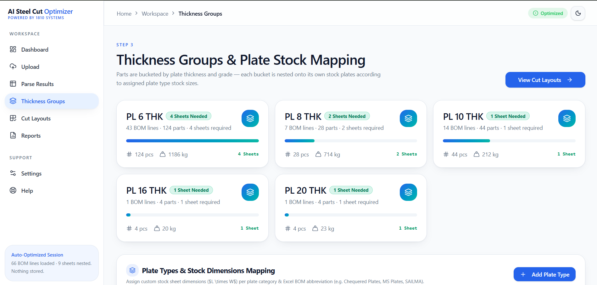
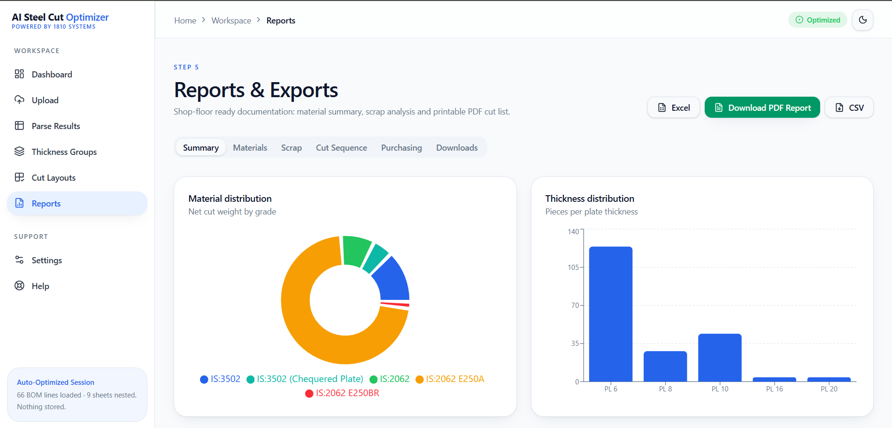
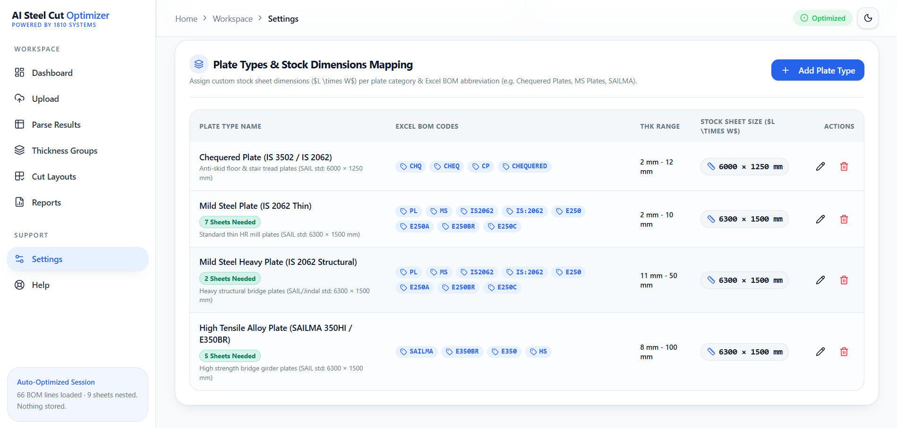

# SteelNest AI — Industrial Plate & Profile Cut Sheet Optimization Platform

> **Enterprise Fabrication Planning & 2D/1D Cut Sheet Optimization Engine — Powered by 1810 Systems**


---

## 🌟 Executive Summary

**SteelNest AI** is a state-of-the-art industrial fabrication planning and plate/profile cut-sheet optimization platform developed by **1810 Systems**. Built specifically for steel fabricators, EPC contractors, and CNC cutting facilities, SteelNest AI transforms raw engineering Bills of Materials (BOMs from Excel, CSV, AutoCAD, Tekla, or ERP systems) into production-ready cut sheet layouts, kerf-optimized CNC torch paths, remnant management reports, and multi-stock procurement plans.

---

## 🖼️ Application Feature Showcase

### 1. Executive Operations Workbench
An all-in-one command center providing instant visibility into active projects, raw BOM parsing health, material stock availability, global scrap percentages, and cutting efficiency KPIs.


---

### 2. Multi-Format BOM Ingestion & Document Parser
Drag-and-drop ingestion supporting `.xlsx`, `.csv`, PDF, and engineering drawings. Features intelligent Regex parsing, confidence scoring, duplicate part detection, and automatic row attribute extraction.


---

### 3. Material & Thickness Grouping Queue
Automatically categorizes incoming line items by material grade (e.g., IS 2062 E250/E350) and plate thickness (e.g., 6mm, 10mm, 12mm, 20mm), isolating production buckets for batch optimization.



---

### 4. 2D Sheet & Remnant Optimization Engine
High-yield layout generator combining Genetic Algorithms, MaxRects, Skyline, and Guillotine packing heuristics. Delivers up to 92%+ material yield while scoring usable offcuts for shop-floor reuse.


---

### 5. Interactive CNC Torch Path & Sequence Visualizer
Real-time SVG/Canvas preview displaying ordered CNC torch cutting sequences, common wall sharing, rapid travel vector paths, and torch lift counts to minimize shop-floor machine wear.


---

### 6. Multi-Sheet Nesting & Layout Management
Manage complex multi-sheet jobs with instant sheet-by-sheet switching, part highlight inspection, grain orientation indicators, and individual scrap breakdown metrics.


---

### 7. Automated Procurement & Production Reports
Generate shop-ready PDF cut packets, Excel procurement workbooks, CNC cut sequence tables, and executive summary reports ready for shop-floor deployment and purchasing teams.



---

### 8. Custom Stock Sizes & Optimization Presets
Flexible configuration center for defining custom raw stock plate sizes (e.g. $6300 \times 1500$, $6000 \times 1250$, $2500 \times 1250$ mm), kerf gap width, sheet margins, and strategy speed presets.



---

### 9. Industrial Knowledge Base & Support
Integrated documentation and assistance hub equipped with technical guides, cutting sequence rules, remnant classification standards, and nesting strategy references.


---

## 🎯 Key Technical Capabilities

* **Digital BOM Ingestion:** Imports `.xlsx`, `.csv`, PDF, and ERP exports while preserving line-item lineage.
* **Deterministic Regex Parsing:** Automatically extracts part marks, material grades, thickness, dimensions, and rotation policies.
* **Confidence Scoring & Queue:** Assigns parsing confidence scores ($0.0 - 1.0$) and routes ambiguous lines to an inline editing queue.
* **Hybrid Optimization Solvers:** Features Genetic Evolutionary Algorithms, MaxRects, Skyline, and Guillotine solvers with kerf, margin, and grain constraints.
* **1D Linear Cutting:** Cut-to-length solver for structural profiles including channels (`ISMC`), beams (`ISMB`), angles, flats, and pipes.
* **CNC Path Minimization:** Shared-wall common cut detection and pathfinding to reduce torch travel time by up to 35%.
* **Remnant Quality Indexing:** Evaluates offcuts for dimensional reusability, reducing scrap weight and inventory wastage.

---

## 🏗️ System Architecture

```
                                  [ User BOM Source ]
                                           │
                                  (Excel / CSV / PDF)
                                           │
                                           ▼
                         ┌─────────────────────────────────┐
                         │   Ingestion & Document Parser   │
                         └─────────────────────────────────┘
                                           │
                                           ▼
                         ┌─────────────────────────────────┐
                         │   Regex Normalizer & Bucketizer │
                         └─────────────────────────────────┘
                                           │
                                 ┌─────────┴─────────┐
                                 ▼                   ▼
                        [ Review Queue ]    [ Canonical Parts ]
                                                     │
                                                     ▼
                         ┌─────────────────────────────────┐
                         │   Optimization Engine           │
                         │   - Population-Based GA         │
                         │   - MaxRects & Guillotine 2D    │
                         │   - 1D Linear Profile Solver    │
                         └─────────────────────────────────┘
                                           │
                                           ▼
                         ┌─────────────────────────────────┐
                         │   Multi-Stock Purchase Advisor  │
                         └─────────────────────────────────┘
                                           │
                                 ┌─────────┴─────────┐
                                 ▼                   ▼
                        [ Canvas Visualizer ]   [ Executive Reports ]
```

---

## 🛠️ Technology Stack

| Layer | Technologies & Frameworks |
| :--- | :--- |
| **Frontend UI** | React 19, TypeScript, Vite 8, TanStack Router, TanStack Query, TailwindCSS v4, Radix UI, Framer Motion |
| **Optimization Core** | Multi-threaded Web Workers, Python FastAPI Engine, `rectpack`, Polars / Pandas, ReportLab |
| **Visualization** | Interactive SVG / HTML5 Canvas Engine with dynamic CNC path rendering |
| **Reporting** | Automated PDF ReportLab Generator, OpenPyXL Excel Exporter |

---

## 📄 Documentation Index

In-depth technical specifications and architectural documentation are available in the `/Documents` directory:
- `steel-plate-cut-sheet-optimizer-blueprint.md`: Complete product requirements and functional blueprint.
- `Architehcure.md`: Data models, database schema, API specifications, and optimization pipeline design.
- `End-to-end workflow.md`: 12-stage industrial fabrication planning workflow.
- `Data inputs Output.md`: Ingestion rules, regex tokenization rules, and report structures.
- `Reports.md`: Shop-floor production, scrap analysis, and procurement reporting standards.

---

## ⚖️ License & Attribution

Developed for industrial steel fabrication planning and manufacturing.  
**Powered by 1810 Systems** — All rights reserved.
